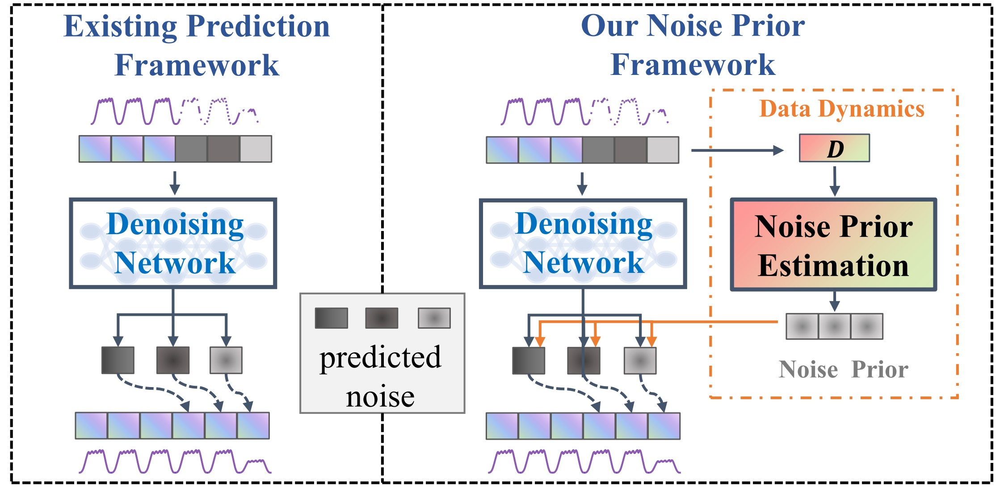
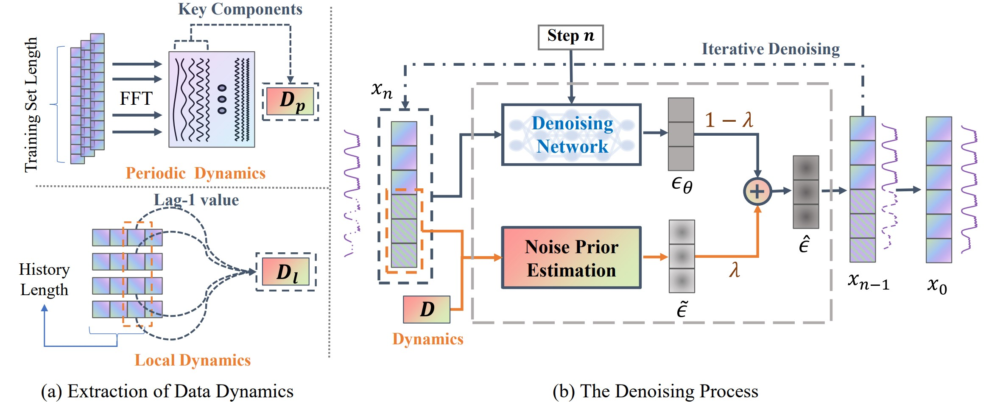

# WWW25-submission-1670

This is the official implementation of our WWW25 submission: **NPDiff: A General Noise Prior Framework for Diffusion Model-based Mobile Traffic Prediction**.

-----


The repo currently includes code implementations for the following tasks:

> **12-12 Prediction**: We provide the script  for the reproduction of 12-12 prediction results in this repo.

> **12-1 Prediction**: We provide the script  for the reproduction of 12-1 prediction results in this repo.


## Introduction
In this paper, we introduce a novel perspective by emphasizing the role of noise in the denoising process. By incorporating the intrinsic dynamics of mobile traffic data as noise priors, we build **NPDiff**, a general noise prior framework for diffusion
model-based mobile traffic prediction. 


## Overall Architecture
NPDiff consists of two main parts: (i) extraction of two key dynamics inherent in mobile traffic data, (ii) the denoising process with noise priors. 


## Data
We use four mobile traffic datasets to demonstrate the effectiveness of NPDiff. You can find the raw datasets in the `./data/mobile_npy/` directory. Before running the experiments, you need to pre-process all data via:
```bash 
cd /path/to/your/project
bash scripts/data_prepare.sh
```


## ⚙️ Installation
### Environment
- Tested OS: Linux
- Python >= 3.9
- torch == 2.3.1

### Dependencies:
1. Install Pytorch with the correct CUDA version.
2. Use the `pip install -r requirements.txt` command to install all of the Python modules and packages used in this project.

## Model Training

We provide the scripts under the folder `./scripts/`. You can train NPDiff(CSDI) with the MobileBJ dataset as the following examples:

```bash 
python main.py --batch_size 8 --device "cuda:2" --Num_Comp 0 --Lambda 0.5 --model "CSDI" --target_dim 672 --history_len 12 --predict_len 12 --data_name "MobileBJ" 
```
Once your model is trained, you will find the trained model in the `./save/` directory. 

There are some new parameters to specify:

- `history_len` specifies the input sequence length.
- `predict_len` specifies the prediction horizon.
- `model` specifies different denoising networks, which can be selected from ["CSDI","ConvLSTM","STID"]

